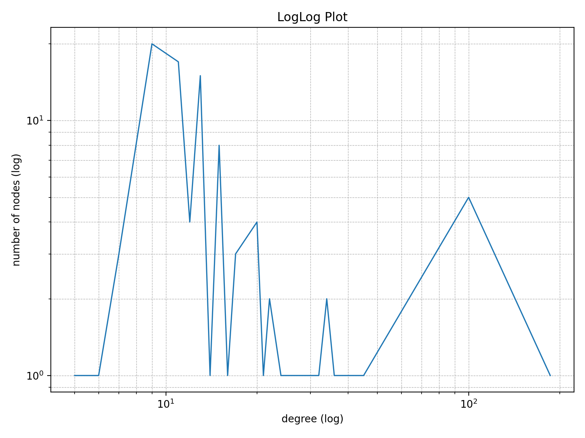
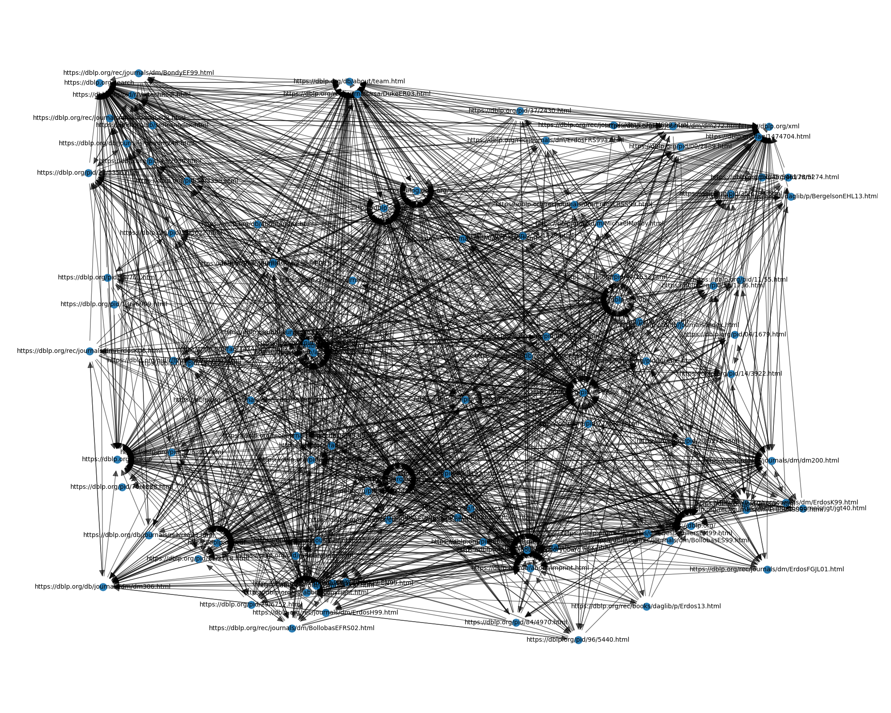

# Information-Network-and-the-WWW
## Mo Gibson and Philip Tran
This program works by creating a graph of the internet using Python and applying the Pagerank algorithm to identify the most relevant pages. 

## Setup Instructions
--crawler: the text file users create to specify the web crawl. First, an integer with the number of pages (total nodes in the graph). Then, the domain that it will crawl. Finally, in order, for each line, the initial web pages to start crawling. All webpages must be in the domain called in the second line.

--input graph.gml: If --crawler isn't called, this calls a directed graph that the program will use for the page rank algorithm and Loglog plot.

--loglogplot: Creates a log-log plot (Specifically this plot to show the Power Laws Distribution; Structure of the Web slides)

--crawler_graph out_graph.gml: Save the directed graph (used for analysis) to "out_graph.gml"

--pagerank_values node_rank.txt: Save the page rank of all the websites analyzed to "node_rank.txt"

## Sample Command-Line Usage
    python page_rank.py --crawler crawler.txt --loglogplot --crawler_graph graph.gml --pagerank_values node_rank.txt

    
The log-log plot                        The visual of the graph
        Also check out the files crawler.txt for a sample input, and graph.gml and node_rank.txt for the output gml file and page rank text respectively.

    python page_rank.py --input graph.gml
        This is the prompt that analyzes the input graph.

## Explaination of Approach
--crawler/input: After analyzing the input txt or .gml file, we use a crawler from the Scrapy library to do a Breadth First Search of the starting/given websites.

--loglogplot: As mentioned in the slides, the in- and out-degree distributions align with the power laws (y = x^-alpha). By using a log-log plot, it shows a strong correlation between the number of pages and the in-degree (as een in the slides).

--pagerank_values: This mirrors the hub/authority activities we did in class. Since a computer does this much faster than a human, it can continue to normalize the score until it stabalizes to around a specific number.